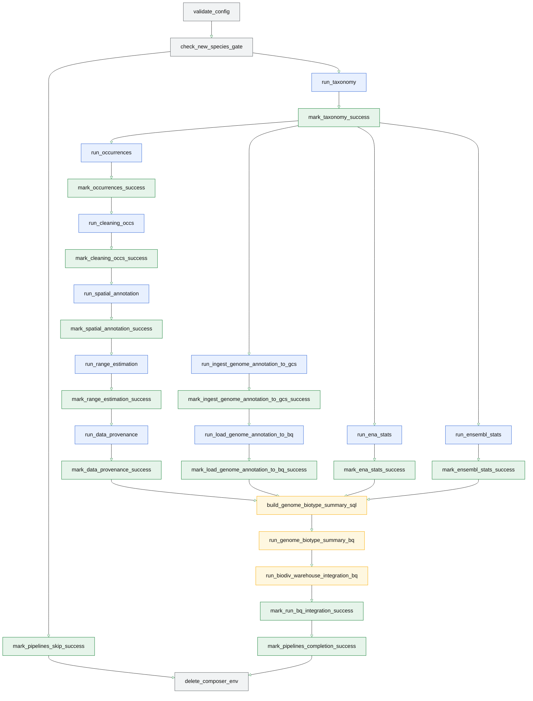

# Biodiversity Airflow DAG Logic

## Overview

This README documents the Airflow DAG logic for the biodiversity pipelines.

The DAG is designed to run inside an ephemeral Cloud Composer 3 environment. The environment is created, restored from a snapshot, used for one DAG execution, and then deleted automatically.

This document focuses only on the Airflow logic:

- DAG structure
- runtime configuration
- gate logic
- Dataflow task orchestration
- success markers
- cleanup behavior

Deployment and lifecycle setup are documented separately.

---

## DAGs

There are two DAG variants in `./dags`:

### 1. `biodiv_pipelines_dag_gcloud_service`

This is the main ephemeral Composer DAG.

It:

- validates configuration
- evaluates whether the pipelines should run
- launches Dataflow Flex Template jobs
- writes success markers
- calls the Composer delete service at the end

This DAG includes the final cleanup task: `delete_composer_env`

### 2. `biodiv_pipelines_dag`

This is the no-delete variant.

It is useful for:

bootstrap testing
validating Dataflow execution
creating snapshots safely
testing pipeline logic without deleting the Composer environment

It does not call the delete-service.

## Execution model

The main DAG is explicitly triggered only.

```python
with DAG(
    dag_id="biodiv_pipelines_dag_gcloud_service",
    description="Biodiv: taxonomy -> occurrences via Dataflow Flex Templates",
    default_args=default_args,
    start_date=datetime(2025, 1, 1),
    schedule=None,
    catchup=False,
    tags=["biodiv", "dataflow", "flex"],
)
```
#### Important behaviour
- schedule=None prevents automatic Airflow scheduling.
- The DAG is triggered externally by the deployment lifecycle.
- catchup=False avoids unintended historical runs if a schedule is added later.
- The DAG deletes the Composer environment after execution.

### High-Level DAG flow
```text
           validate_config
                 ↓
        check_new_species_gate
                 ↓
      ┌─────────────────────────┬
      │                         │                      
run_pipelines          mark_pipelines_skip    
      │                         │                      
      ↓                         ↓                    
_SUCCESS markers          _SKIPPED marker      
      │                         │                  
      └────────────┬────────────┘
                   ↓    
           delete_composer_env
```
### Runtime configuration
Runtime configuration is loaded using:

```python
cfg = load_config()
```
The configuration is defined in: `biodata/airflow/biodiv_airflow/config.py`

The config object is represented by the `BiodivConfig` dataclass.

Configuration values are loaded from:

- Airflow Variables
- Secret Manager, via Airflow Secret Manager backend
- derived defaults based on the GCS bucket and project settings

#### Required variables

```text
biodiv_gcp_project
biodiv_gcp_region
biodiv_bucket
biodiv_image_tag
biodiv_dataflow_worker_sa_email
biodiv_bq_dataset
dev_delete_service_url
```
#### Optional / Defaulted Variables
Some variables have defaults in `load_config()`.

```text
biodiv_flex_base
biodiv_output_base
biodiv_df_temp_location
biodiv_df_staging_location
biodiv_sdk_container_image
elasticsearch_pages
elasticsearch_size
ena_sleep_s
ensembl_sleep_s
beam_min_batch_size
beam_max_batch_size
min_new_species_threshold
```
Example of defaulted variable: `biodiv_output_base = gs://<bucket>/biodiv-pipelines-dev`

**NOTES**:
- `ena_sleep_s` is reused for all ENA API calls, including taxonomy lookup and ENA assembly stats.
- `ensembl_sleep_s` controls throttling for Ensembl genome stats API calls.

#### Secret-backed Variables

Sensitive values should be resolved through Secret Manager using `Variable.get('var')`. 

#### Configuration Timing
Configuration is loaded at DAG import time. This means the Composer environment must already have:

- restored Airflow Variables
- configured Secret Manager backend
- access to required secrets

before the DAG is triggered.

This is why the deployment lifecycle is: `create environment → load snapshot → trigger DAG` 
and not: `create environment → immediately run DAG`.

## DAG run

#### DAG run output structure

The DAG writes outputs under a per-run prefix:

`<output_base>/runs/window_start={{ ds }}/run_ts={{ ts_nodash }}`

All pipeline artifacts are written under this prefix. 
It keeps output files organised and isolated per run.

### Validation task
The validation task, `validate_config` validates the configuration and the environment.

This validation checks:

- required project/bucket/image/output variables
- valid GCS path structure
- presence of elasticsearch_password
- expected partition structure in run_prefix

If validation fails, the DAG stops before launching Dataflow jobs.

### Gate task
The gate task, `check_new_species_gate`, decides whether the Dataflow pipelines should run.

The gate compares:

Species/taxonomy IDs from Elasticsearch where annotation is complete
Already logged taxonomy IDs in BigQuery

The BigQuery gate table is: `<project>.<dataset>.bp_log_taxonomy`

The gate computes: `new_tax_ids = Elasticsearch tax IDs - BigQuery logged tax IDs`
Then compares the count against: `new_tax_ids >= min_new_species_threshold`
If the threshold is met, the DAG continues to `run_taxonomy`.
If not met, it skips the pipeline chain, writes the `_SKIPPED` marker,
and proceeds to delete the environment.

### Dataflow Pipeline Chain

The diagram shows the full ephemeral DAG. The no-delete validation DAG follows the same pipeline branches but omits `delete_composer_env`.


After `mark_taxonomy_success`, four branches run in parallel:

- occurrence, cleaning, spatial annotation, range estimation, and provenance
- genome annotation ingestion and BigQuery loading
- ENA assembly stats
- Ensembl genome stats

The BigQuery warehouse integration branch waits until provenance, genome annotations,
ENA stats, and Ensembl stats have all been loaded to BigQuery. It then builds the
genome biotype summary and recreates the integrated warehouse table.

### Dataflow Template Specifics

The templates are defined in: `biodata/data_ingestion`.
Dataflow request bodies are defined in: `biodiv_airflow/dataflow_specs.py`.

Each request body includes:

- Dataflow job name
- Flex Template path
- pipeline parameters
- Dataflow environment settings
- service account
- temp and staging locations
- additional labels

### Pipeline stages

#### 1. Taxonomy

Task `run_taxonomy`.

Purpose:

- reads annotated taxonomy data from Elasticsearch
- writes validated taxonomy output compiling ENA taxonomy and GBIF taxonomy harmonisation. 
- writes taxonomy logs to BigQuery

Main outputs:

```text
<run_prefix>/taxonomy/taxonomy_validated.jsonl
<project>.<dataset>.bp_taxonomy_validated
<project>.<dataset>.bp_log_taxonomy
```

#### 2. Occurrences

Task `run_occurrences`.

Purpose:

uses validated taxonomy as input
fetches occurrence records
writes raw occurrence JSONL files

Main output:

`<run_prefix>/occurrences/raw/occ_species_name.jsonl` for each species name.

#### 3. Cleaning Occurrences
Task `run_cleaning_occs`.

Purpose:
- reads raw occurrence JSONL files
- Applies cleaning rules for occurrence data (e.g., malformed coordinates, coordinates at the sea, coordinates on administrative centroids, etc.)
- writes occurrence records with cleaned up fields to GCS and BigQuery.

Main output:
```text
<run_prefix>/occurrences/cleaned/occ_species_name.jsonl
<project>.<dataset>.bp_gbif_occurrences
```

#### 4. Spatial Annotation

Task `run_spatial_annotation`.

Purpose:
- enriches cleaned occurrence data with spatial / environmental context
- uses climate layers and ecoregion data
- writes spatial annotation summaries
- writes summary data to BigQuery

Main output:
```text
<run_prefix>/spatial/spatial_annotations.jsonl
<run_prefix>/spatial/spatial_annotations_summary.jsonl
<project>.<dataset>.bp_spatial_annotations
```

#### 5. Range Estimation

Task `run_range_estimation`.

Purpose:
- estimates occurrence range from cleaned occurrence records
- writes range estimates to BigQuery

Main outputs:

`<project>.<dataset>.bp_species_range_estimates`

#### 6. Data Provenance

Task `run_data_provenance`.

Purpose:
- extracts data sources' urls for each species.  
- writes provenance data to BigQuery

Main outputs:

```text
<run_prefix>/data_provenance/metadata_urls.jsonl
<project>.<dataset>.bp_provenance_metadata
```

#### 7. Genome Annotation Ingestion

Tasks:
- `run_ingest_genome_annotation_to_gcs`
- `run_load_genome_annotation_to_bq`
- `build_genome_biotype_summary_sql`
- `run_genome_biotype_summary_bq`

Purpose:
- looks up GTF URLs for validated taxonomy records
- downloads available GTF files
- writes download and BigQuery ingestion manifests
- loads parsed genome annotations into BigQuery
- builds genome biotype summaries for the current run

Main outputs:

```text
<run_prefix>/gtf_manifest/gtf_gcs_paths.jsonl
<run_prefix>/gtf_manifest/download_status.jsonl
<run_prefix>/gtf_manifest/bq_ingestion.jsonl
<run_prefix>/gtf_manifest/bq_invalid_accessions.jsonl
<project>.<dataset>.bp_genome_annotations
<project>.<dataset>.bp_genome_biotype_summary
```

#### 8. ENA and Ensembl Stats

Tasks:
- `run_ena_stats`
- `run_ensembl_stats`

Purpose:
- reads validated taxonomy/accession records
- retrieves ENA assembly statistics
- retrieves Ensembl genome statistics
- writes stats and error manifests to GCS
- loads stats into BigQuery

Main outputs:

```text
<run_prefix>/ena/ena_stats.jsonl
<run_prefix>/ena/ena_errors.jsonl
<run_prefix>/ensembl/ensembl_stats.jsonl
<run_prefix>/ensembl/ensembl_errors.jsonl
<project>.<dataset>.bp_ena_stats
<project>.<dataset>.bp_ensembl_stats
```

#### 9. Biodiv Warehouse Integration
Task `run_biodiv_warehouse_integration_bq`.

Purpose:

Combines and writes genome annotation summaries, validated taxonomy,
occurrence records, spatial annotation summaries, range estimates, provenance,
ENA assembly stats, and Ensembl genome stats using a BigQuery table with a nested
schema implementing structs and arrays of structs in rows identified by genome
accession IDs, 1 row per reference genome.

Main output:
`<project>.<dataset>.bp_integ_genome_biodiv_annotations`

#### 10. Success markers
The DAG writes success markers to indicate pipeline completion.
After each Dataflow stage, the DAG writes a marker file to GCS.

Marker files are written using: `write_gcs_marker()`

The marker is an empty file uploaded to GCS.

Examples:

```text
<run_prefix>/taxonomy/_SUCCESS
<run_prefix>/occurrences/raw/_SUCCESS
<run_prefix>/occurrences/cleaned/_SUCCESS
<run_prefix>/spatial/_SUCCESS
<run_prefix>/range_estimates/_SUCCESS
<run_prefix>/data_provenance/_SUCCESS
<run_prefix>/gtf_manifest/_SUCCESS_INGEST_TO_GCS
<run_prefix>/gtf_manifest/_SUCCESS_LOAD_TO_BQ
<run_prefix>/gtf_manifest/_SUCCESS_BQ_INTEGRATION
<run_prefix>/ena/_SUCCESS
<run_prefix>/ensembl/_SUCCESS
<run_prefix>/_SUCCESS
```
If the gate skips execution, the DAG writes: `<run_prefix>/_SKIPPED` marker.

The pipelines are audited in search for species missed among runs. 
These species are backfilled by manual runs of the pipeline. In these cases,
the run/pipeline marker is `<run_prefix>/_BACKFILLED_MANUAL`

#### 11. Delete Composer Environment step
The DAG calls the Composer delete service using task `delete_composer_env`.

It calls: `call_delete_service()`

The delete service URL comes from variable: `dev_delete_service_url`

The task is configured with: `trigger_rule="all_done"`
This means it runs even if upstream pipeline tasks fail.

##### Delete Service Authentication

The DAG calls the private Cloud Run delete-service using an OIDC ID token:
`id_token.fetch_id_token(auth_req, delete_url)`

The request is sent as: 
```text
POST <delete-service-url>
Authorization: Bearer <id-token>
```
The Composer runtime service account must have permission to invoke the delete-service.


## Failure Behavior
### Validation failure

If validate_config fails:

- no Dataflow jobs are launched
- the DAG fails before pipeline execution
- Gate skip

If the gate threshold is not met:

- Dataflow jobs are skipped
- `_SKIPPED` marker is written
- environment deletion still runs

### Dataflow failure

If a Dataflow job fails:

- downstream pipeline tasks do not continue
- delete task still runs because of trigger_rule="all_done"

### Delete failure

If delete-service returns authentication or non-retryable errors:

- `delete_composer_env` fails
- environment may remain running
- manual cleanup may be required

## Operational Notes

### DAG parsing depends on restored configuration

Because config is loaded at import time, the DAG should only be triggered after snapshot load has completed.

### The no-delete DAG is for validation only

Use biodiv_pipelines_dag when testing pipeline execution and creating the baseline snapshot.

Use biodiv_pipelines_dag_gcloud_service for the ephemeral lifecycle.

### Deletion is asynchronous

The delete task requests environment deletion. The environment may begin shutting down immediately after the request is accepted.

As a result:

- Airflow UI may disappear
- logs may be incomplete
- the task usually still marks success before teardown completes